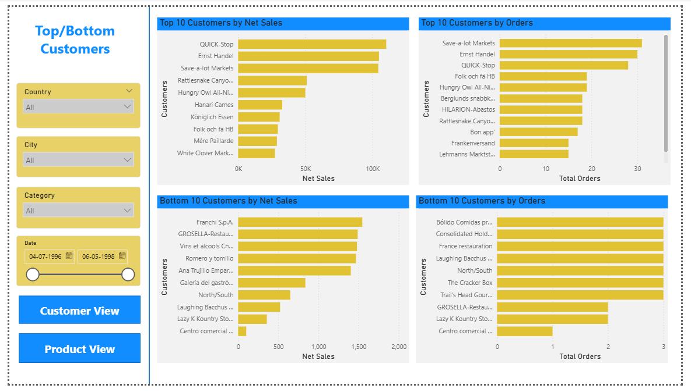

# 📊 Sales Overview Dashboard (Power BI)

## 📌 Overview

This project is an interactive Power BI dashboard designed to analyze sales performance across different dimensions such as country, category, customer, and time. It helps in identifying trends and making data-driven decisions.

---

## 🎯 Objectives

* Analyze overall sales and order performance
* Identify trends over time
* Compare performance across regions and categories
* Identify top and bottom performing products and customers

---

## 🛠️ Tools & Technologies

* Power BI
* Data Visualization
* Data Modeling

---

## 📊 Dashboard Pages

### 🔹 1. Sales Overview (Net Sales View)

* KPIs: Net Sales, Total Orders, Total Customers
* Sales trend and country-wise analysis
* Category-wise performance
* Interactive filters

👉 **Navigation Feature:**

* A button **“Show in Orders”** is provided
* Clicking it redirects to the **Orders Dashboard (Sheet 2)**

---

### 🔹 2. Sales Overview (Orders View)

* Order-based KPIs and analysis
* Order trends over time
* Customer and category insights

👉 **Navigation Feature:**

* A button **“Show in Net Sales”** is provided
* Clicking it redirects back to the **Net Sales Dashboard (Sheet 1)**

---

### 🔹 3. Top/Bottom Analysis

This page provides a comparative analysis of best and worst performers based on both **Net Sales** and **Total Orders**, with dynamic switching between Product and Customer perspectives.

#### ✅ Product View

* Displays **Top 10 products by Net Sales and Orders**
* Shows **Bottom 10 products** to identify low-performing items
* Useful for product performance evaluation

#### ✅ Customer View

* Displays **Top 10 customers by Net Sales and Orders**
* Shows **Bottom 10 customers** to identify low-engagement customers
* Useful for customer analysis and segmentation

👉 **Toggle Feature:**

* Buttons **“Product View”** and **“Customer View”** are provided
* Clicking them switches between product and customer analysis

---

## 📐 Key Features

* Interactive slicers (Country, City, Category, Date)
* Dynamic KPI cards
* Page navigation buttons (Net Sales ↔ Orders)
* Toggle-based dynamic view (Product vs Customer)
* **Synchronized filters across all pages**

---

## 📈 Key Insights

* Identified top-performing countries, customers, and products
* Observed trends in sales and orders over time
* Highlighted best and worst performing entities
* Compared product vs customer performance

---

## 📁 Files Included

* `Sales Overview Project.pbix` – Power BI dashboard file

---

## 📸 Dashboard Preview

### 🔹 Sales Overview

---

### 🔹 Orders Overview

---

### 🔹 Product View

---

### 🔹 Customer View

---

## 🚀 Purpose

This project was created to practice Power BI and to understand how business data can be visualized effectively.

---

## 🔮 Future Improvements

* Add advanced DAX measures
* Improve dashboard design
* Enhance interactivity

---
