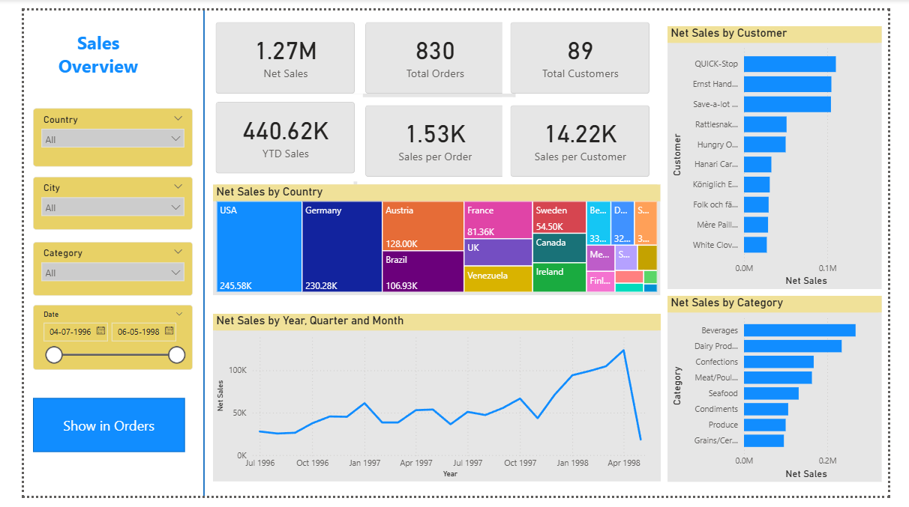
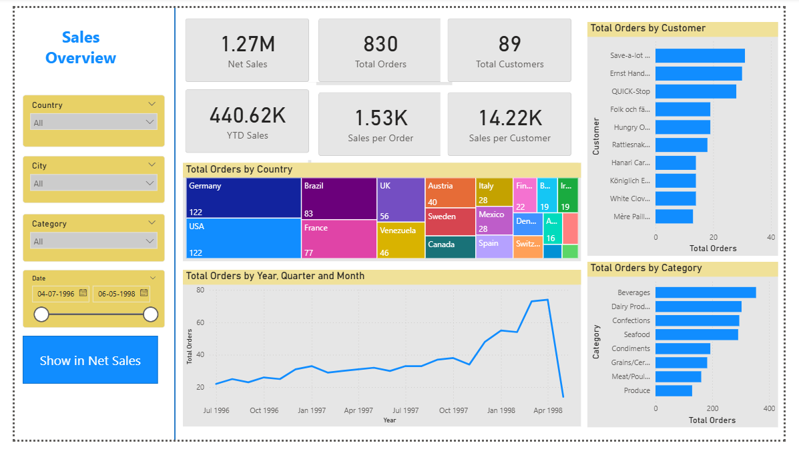
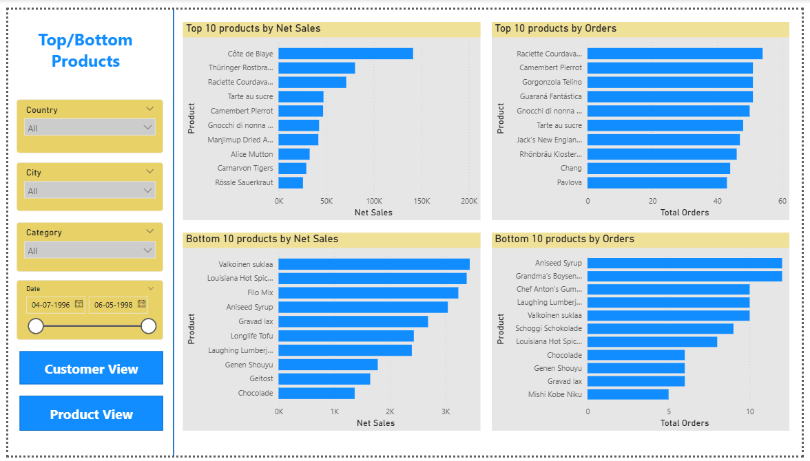

# 📊 Sales Overview Dashboard (Power BI)

## 📌 Overview

This project is an interactive Power BI dashboard designed to analyze sales performance across multiple dimensions such as country, category, customer, and time. It helps in identifying trends, evaluating performance, and supporting data-driven decision-making.

---

## 🎯 Objectives

* Analyze overall sales and order performance
* Identify trends over time
* Compare performance across countries and categories
* Identify top and bottom performing products

---

## 🛠️ Tools & Technologies

* Power BI
* Data Visualization
* Data Modeling

---

## 📊 Dashboard Pages

### 🔹 1. Sales Overview

* KPIs: Net Sales, Total Orders, Total Customers
* Sales distribution by country (Tree Map)
* Sales trend over time (Line Chart)
* Top customers by sales
* Category-wise sales analysis
* Interactive filters: Country, City, Category, Date

---

### 🔹 2. Sales Overview (Orders)

* KPIs focused on order metrics
* Orders distribution by country
* Order trends over time
* Top customers by total orders
* Category-wise order analysis

---

### 🔹 3. Top/Bottom Products

* Top 10 products by Net Sales
* Top 10 products by Orders
* Bottom 10 products analysis
* Identifies high and low performing products

---

## 📐 Key Features

* Interactive slicers (Country, City, Category, Date)
* Dynamic KPI cards
* Multi-page dashboard navigation
* Comparative and trend analysis

---

## 📈 Key Insights

* Top-performing countries and customers identified
* Sales and order trends observed over time
* High and low performing products highlighted
* Comparison between sales and order behavior

---

## 📁 Files Included

* `Sales Overview Project.pbix` – Power BI dashboard file

---

## 📸 Dashboard Preview

### 🔹 Sales Overview

This page provides a high-level view of overall sales performance, including KPIs, sales trends, and regional distribution.

---

### 🔹 Orders Overview

This page focuses on order-based analysis, helping to understand order volume trends and customer behavior.

---

### 🔹 Top/Bottom Products

This page highlights the best and worst performing products based on sales and orders.

---

## 🚀 Purpose

This project was created to practice Power BI dashboard development and to demonstrate the ability to convert raw data into meaningful business insights.

---

## 🔮 Future Improvements

* Add advanced DAX measures
* Improve UI/UX design
* Add drill-through functionality
* Enhance interactivity

---
